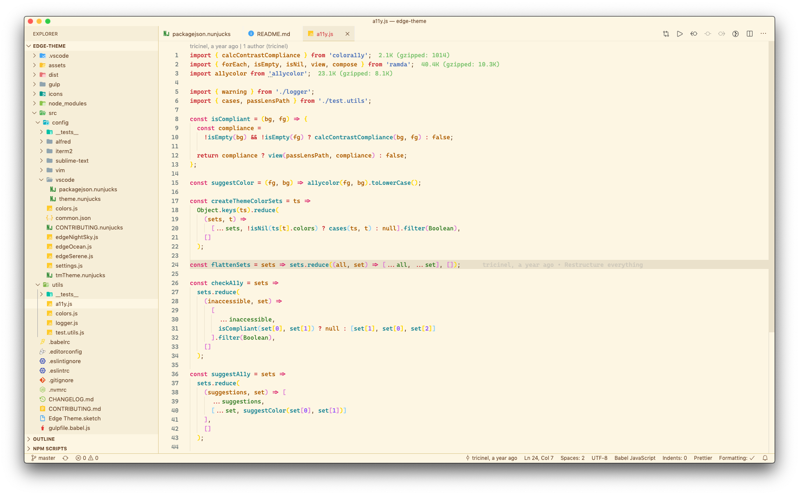

`Edge` is a simple theme with bright colors. Edge comes in three versions — _Night Sky_, _Serene_ and _Ocean_ for all day long comfortable work.

## Installation

You can install `Edge` via Visual Studio Code's **Extensions** panel.

1.  Press <kbd>cmd/ctrl</kbd> + <kbd>shift</kbd> + <kbd>p</kbd> to open the command palette.
2.  Type `Install extensions` and press enter.
3.  Search for `edge-theme`.
4.  Click **Install** to install it.
5.  Click **Reload** to reload VSCode.

## Activation

### Recommended

Use the key combination <kbd>cmd/ctrl</kbd> + <kbd>T</kbd> + <kbd>cmd/ctrl</kbd> + <kbd>K</kbd> to bring up the theme selector panel.

Or from the menu bar click: `Code > Preferences > Color Theme > Edge Night Sky/Edge Serene/Edge Ocean`.

## Screenshots

**Edge Night Sky**

**Edge Serene**

**Edge Ocean**

## Syntax Highlighting

**Javascript**

**React**

**CSS**

**HTML**

## Contributing to Edge

**Please check the CONTRIBUTING.md file before forking this repo!**
